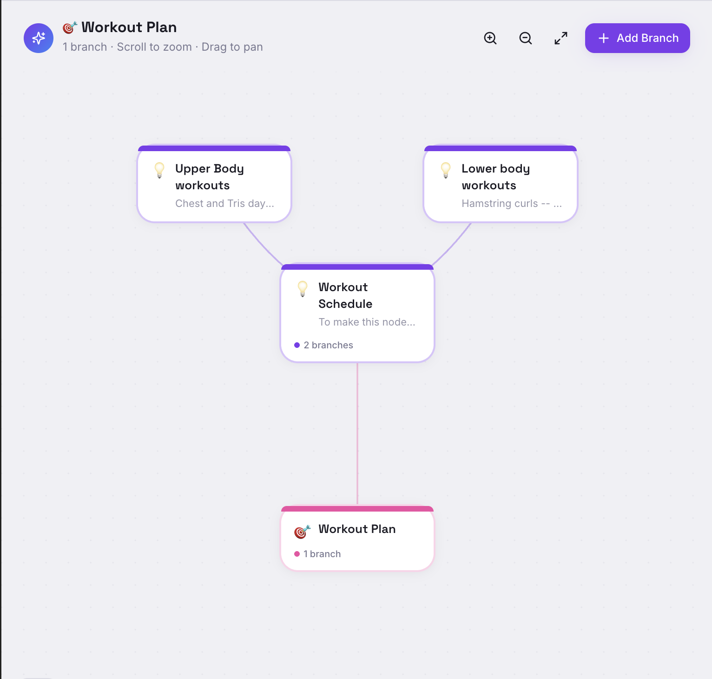
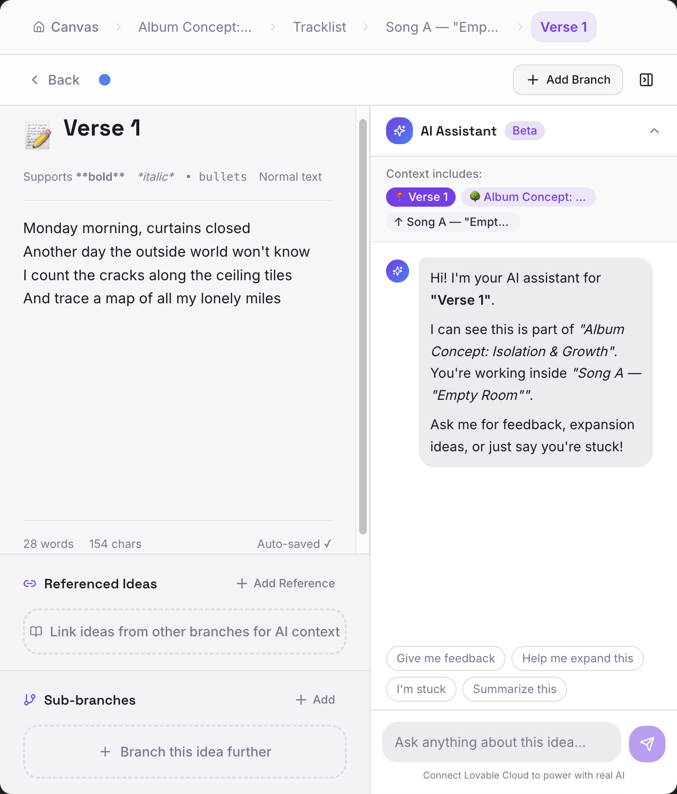

# 🧠 BrainJot — Your Digital Thinking Canvas

> “Don’t let your ideas pass you by.”

BrainJot is an AI-powered digital whiteboard designed to mirror how the human brain actually thinks — non-linear, dynamic, and deeply interconnected.

Instead of forcing ideas into rigid notes, BrainJot allows users to:
- Branch thoughts into independent yet connected idea hubs
- Explore tangents without losing the core concept
- Build layered structures for creative, analytical, and strategic thinking
- Leverage AI assistance directly within each node for real-time idea expansion

This transforms note-taking into **active thinking, structuring, and creation.**

## ✨ Core Features

- 🌿 Dynamic Branching System
  - Turn any idea, phrase, or text selection into a connected branch without cluttering the original workspace
  
- 🧠 **Hierarchical Idea Mapping**
  - Organize thoughts from main ideas → sub-ideas → micro-components

- 🤖 **Context-Aware AI Assistant**
  - AI understands where you are in the idea tree
  - Provides feedback, expansion, and alignment suggestions

- 🔗 **Referenced Ideas System**
  - Link ideas across branches to maintain thematic consistency

- ✍️ **Inline Editing + AI Actions**
  - Highlight text to:
    - Expand
    - Rewrite
    - Branch into new ideas
    - Compare with references

- 🔄 **Seamless Navigation**
  - Move between main ideas and branches without losing context

## 🚀 Demo

### 🧠 Canvas View (Idea Graph)

### 🌿 Branching System (Idea Expansion)

### 🤖 Context-Aware AI Assistance

## 🎯 Use Cases

BrainJot is designed for high-level thinkers and creators:

- 🎵 Music & Creative Writing (lyrics, album concepts, storytelling)
- 📚 Educational Note-Taking (deep topic breakdowns)
- 🧠 Brainstorming & Idea Mapping
- 📊 Business Planning & Strategy
- 🏋️ Structured Planning (workouts, routines, schedules)
- 🎬 Content Creation & Storyboarding

## 💡 The Problem

Traditional note-taking apps force linear thinking.

But real thinking is:
- Non-linear
- Iterative
- Tangential

Ideas don’t happen in straight lines — they branch, connect, and evolve.

## 🚀 The Solution

BrainJot creates a system where:
- Every idea can expand without clutter
- Every branch can evolve independently
- AI helps guide, refine, and connect ideas in real time
  
## 📌 Status

Prototype built with Lovable.
Actively iterating on AI reasoning and interaction design.

## 🛠️ Tech Stack

- Frontend: React (Lovable-generated UI)
- State Management: Dynamic node-based structure
- AI Integration: Context-aware assistant per node
- Data Model: Graph-based idea relationships
- Platform: Lovable (rapid prototyping)

## 🔮 Future Enhancements

- 🔗 True inline AI (edit content directly without sidebar)
- 🧩 Dynamic word-level branching (hyperlink-style idea expansion)
- 🎥 Interactive demo (GIF-based walkthrough)
- ☁️ Cloud sync + persistence
- 🧠 Advanced AI memory across idea trees

## 👤 Author

Oluwaseyi Adewuya
